# ClauseKit

**AI legal assistant for Microsoft Word**

Review and redline contracts, then simulate the negotiation - without leaving the document

 

---

## What it does

- **Grounded contract Q&A** - answers come from the document in front of you, cited by the clause (`§`) number
- **One-click redlines** - proposes exact replacement language and applies it as a native tracked change in Word
- **Negotiation simulator** - builds a fallback ladder per off-market term and role-plays opposing counsel

## Architecture

<!-- Static render (no GitHub mermaid pan/zoom controls). Source: docs/architecture.mmd
     Regenerate after editing: npx -y @mermaid-js/mermaid-cli -i docs/architecture.mmd -o docs/architecture.svg -b transparent -->

## Design

- **Inspiration** - benchmarked against the products ClauseKit lives beside: [Spellbook](https://www.spellbook.legal/) for AI contract-review UX patterns, [Resend](https://resend.com/home/) for the dark, typography-led aesthetic of the landing page.
- **Design system** - built with **Claude**: near-black ink surfaces with a single amber accent, Newsreader serif display over Inter body text, Roboto Mono for section references and labels (source of truth in `frontend/src/landing.css`).
- **Prototypes** - svg's finalized in **Figma** before implementation.
- **Inside Word** - the task pane uses **Fluent UI** so ClauseKit reads as native Microsoft Word UI rather than a bolted-on web view.

## Repository structure

| Folder | What it is |
|:-------|:-----------|
| `microservices/` `word-addin/` | **Word Office Add-in** - React + TypeScript task pane running inside Microsoft Word via Office.js Entry `src/taskpane/index.tsx` · build with `npm start` from that folder · owns its own `package.json`, `webpack.config.js`, `tsconfig.json`, `manifest.xml`, and `assets/` |
| `frontend/` | **Landing page** - React + TypeScript, built with Vite, hand-authored CSS `npm run dev` to serve locally · `npm run build` to bundle |
| `backend/` | **Backend API** - Node.js + Express + tRPC, calling Claude via the Anthropic SDK typed procedures `ask` (document-grounded Q&A) and `negotiate` (negotiation brief) at `/trpc` · deprecated REST mirrors at `/api/*` · entry `src/index.ts` |

## Tech stack

Mostly TypeScript. Each area owns its own dependencies and build config - there is no shared root `package.json`.

<b>Frontend</b> - <code>frontend/</code>

 

- **React** + **TypeScript**, bundled with **Vite** (`@vitejs/plugin-react`).
- **Plain CSS** (hand-authored design system in `src/landing.css`).
- Assets (SVG / MP4 / images) imported through Vite.

<b>Word add-in</b> - <code>microservices/word-addin/</code>

 

- **React** + **TypeScript** task pane running inside Word via **Office.js**.
- **Fluent UI** (`@fluentui/react-components`) for UI, **Less** for styling.
- Bundled with **Webpack** + **Babel**; tooling via the **Office Add-in CLI** (`office-addin-*`). Loaded into Word through `manifest.xml`.
- `docx` generates the sample lease document.

<b>Backend</b> - <code>backend/</code>

 

- **Node.js** + **Express** + **TypeScript**, run directly with **tsx** (ESM).
- **tRPC** (Express adapter at `/trpc`) with **zod** schemas as the single source of truth for the wire contract - the Word add-in's client infers full request/response types from `AppRouter`, so contract drift fails at compile time. Deprecated REST mirrors kept at `/api/*` for curl-based smoke tests.
- **Anthropic SDK** (`@anthropic-ai/sdk`) for all LLM calls - **Claude Haiku 4.5** by default, model swappable via env (Sonnet/Opus for heavier reasoning).
- Structured outputs via **tool use**, with server-side verbatim validation so a suggested edit's original text is always an exact substring of the contract.
- **Prompt caching** on the stable system prompt + contract prefix to cut cost/latency.
- Hardening: **CORS** allowlist, **express-rate-limit** (per-minute + daily caps), and a daily token spend backstop.
- **MongoDB** (optional, e.g. Atlas M0): persists the spend counter across container restarts (atomic `$inc` per UTC day - essential on scale-to-zero Cloud Run) and records per-call usage metadata (`sessions`; never contract text). Degrades gracefully to in-memory state when unset/unreachable.
- **Docker** (`backend/Dockerfile`) for deployment.

<b>AI / model layer</b>

 

- **Claude** (Anthropic) is the single model provider, called only from the backend so the API key never reaches the client.
- Two endpoints: contract-review Q&A (`/api/ask`) and the negotiation simulator (`/api/negotiate`).

## Deployment

| Piece | Platform | How |
|:------|:---------|:----|
| `frontend/` · `microservices/` `word-addin/` | **Vercel** | Two static deployments each built and served from its own `vercel.json` |
| `backend/` | **Google Cloud Run** | Docker container from `backend/Dockerfile` platform injects `PORT` + secrets (`ANTHROPIC_API_KEY`, `MONGODB_URI`, `ALLOWED_ORIGINS`) · see `.env.example` |

---

Built by <a href="https://github.com/markbuckle">Mark Buckle</a>

